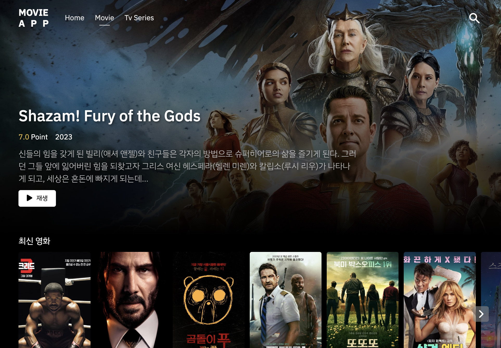

# Movie APP

<p align="center">
  
</p>

## 💻 Stack

<div align="center">


</div>

## index

- [Description](#description)
- [Page](#page)
- [Function](#Function)

## Description

- Movie, Tv series 정보를 보여주는 웹사이트 입니다

- "The Movie Database" 에서 제공하는 api를 이용해서 제작되었습니다

- 반응형으로 제작되었습니다

## Getting Started

### Install

```
$ yarn install
```

### Start

```
$ yarn dev
```

## Directory

```
├── apis
│   ├── interface     # api관련 인터페이스
│   ├── ...Api.ts     # api관리
├── components        # atomic design시스템으로 관리
│   ├── atoms         # 가장 작은 단위 컴포넌트
│   ├── organism      # 재사용되는 컴포넌트
│   ├── template      # 페이지 레이아웃
├── hooks             # 커스텀 훅
├── lib               # DB연결
├── pages             # 페이지 관리
├── store             # 전역 상태 관리
├── styles            # 공통 스타일 및 테마 관리
├── utils             # 유틸 함수
└── ....etc
```
